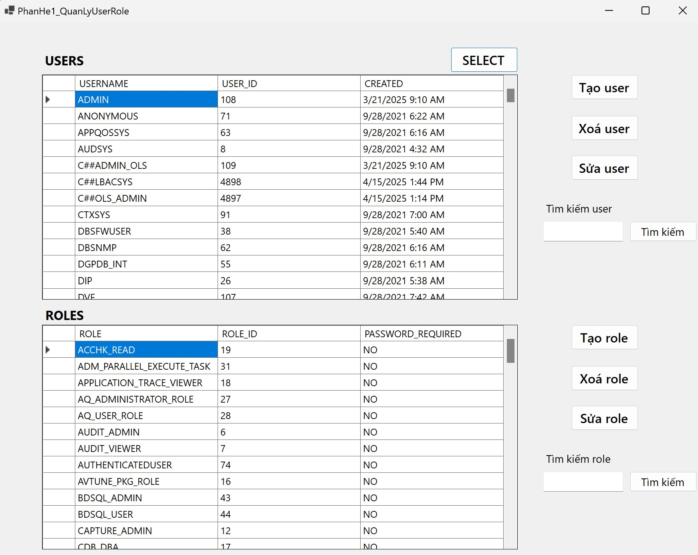

# 🔐 Oracle Database Security Management System - WinForms Project

This is a WinForms application developed for the **Database Security in Information Systems** course (`CSC12001`). The system is built for a fictional university (University X) and includes secure data management through Oracle security mechanisms such as **RBAC**, **VPD**, **OLS**, **Audit**, and **Backup/Restore**.

---

## Sreenshots
  

## 🧩 Subsystem 1: Oracle Database Administration Tool

A module for **Database Administrators** to manage user and role access on Oracle DB Server.

### ✅ Features:
1. Create, edit, and delete **users** and **roles**.
2. View list of users and roles in the system.
3. Grant privileges:
   - Grant system and object-level privileges to users or roles.
   - Support `WITH GRANT OPTION`.
   - Grant on objects: `TABLE`, `VIEW`, `PROCEDURE`, `FUNCTION`.
   - Column-level access for `SELECT`, `UPDATE`.
4. Revoke privileges.
5. View privilege map of each user/role on database objects.

---

## 🧩 Subsystem 2: Internal Data Management Application

A system for role-based access to University X’s internal data with strong security enforcement using **RBAC** and **VPD**.

### 🗄️ Key Tables:
- `NHANVIEN` – Employee data
- `SINHVIEN` – Student data
- `DONVI` – Departments (e.g., Khoa Hóa, Phòng Đào tạo)
- `HOCPHAN`, `MOMON`, `DANGKY` – Course & Enrollment information

### 🔐 Security Models:

#### 🔹 Role-Based Access Control (RBAC)
- Role: `NVCB`, `GV`, `NV_PĐT`, `NV_TCHC`, `TRGĐV`, etc.
- Example: `NV_TCHC` can fully manage `NHANVIEN`, `GV` can see classes they teach, etc.

#### 🔹 Virtual Private Database (VPD)
- Row-level filtering based on logged-in user
- Example: Students only see/edit their own records, restricted access during registration period, etc.

---

## 📢 Subsystem 3: Label-Based Access Control (OLS) (Not yet implemented)

Implements secure **notification distribution** using Oracle Label Security based on:

- **Clearance level**: Student < Staff < Unit Head
- **Domain/field**: e.g., Math, Chemistry, Administration
- **Location**: Campus 1 or Campus 2

🔐 Example:
- u5 (student from Chemistry - campus 2) only sees messages tagged as chemistry & campus 2.

---

## 📜 Subsystem 4: Auditing System (Not yet implemented)

Implements both **Standard** and **Fine-Grained Auditing (FGA)** to monitor sensitive actions.

### 🎯 Auditing Scenarios:
1. Unauthorized access to salary info by non-`TCHC` users.
2. Unauthorized edit of grades by non-`PKT` staff.
3. Student editing another student's records or outside allowed timeframe.

---

## 💾 Subsystem 5: Backup & Restore (Not yet implemented)

Implements **Oracle backup and recovery techniques** based on the system audit trail.

### 🔄 Included:
- Manual and automated backup strategies
- Point-in-time recovery tests
- Comparison of methods (e.g., RMAN, Data Pump)

---

## 🚀 How to Run

1. Import the Oracle SQL scripts from `SQL_Scripts/` in the following order:
   - `DaiHocX.sql`, `Create_role_and_account.sql`, then RBAC/VPD/OLS/Procedures
2. Open the solution: `ATBM_UI_new.sln` in Visual Studio
3. Restore NuGet packages if necessary.
4. Build and run the WinForms app
5. Log in with created Oracle users to test role-based and label-based access

---

## 📌 Notes

- Tested on Oracle 21c & Windows 10 with .NET 8
- Visual Studio 2022 required for `.sln` file

## Contact  
📧 Email: hoangson14112004@gmail.com
